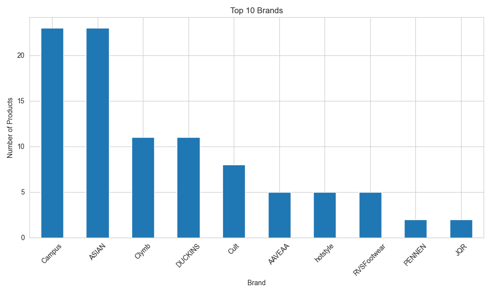
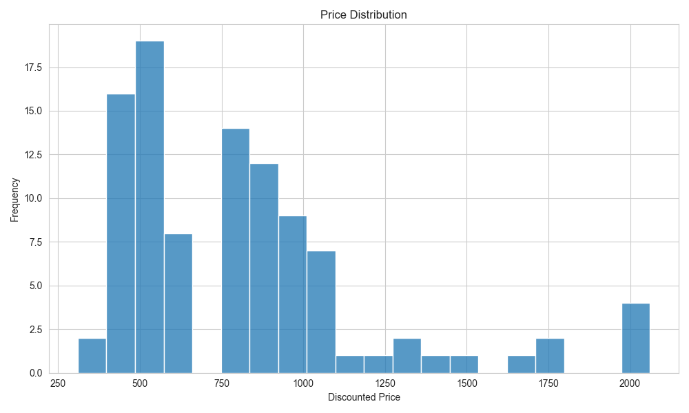
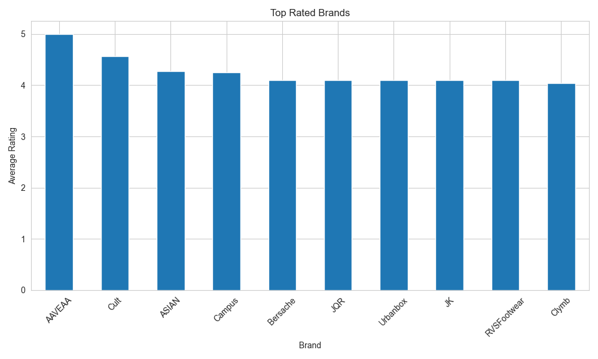

# Snapdeal Men's Sports Shoes Web Scraper

## Project Overview

This project is a Python-based web scraping and data analysis application that extracts men's sports shoes data from Snapdeal.

The scraper collects product information such as:

* Product Name
* Brand
* Original Price
* Discounted Price
* Discount Percentage
* Product Rating
* Number of Reviews

The extracted data is stored in CSV format and visualized using charts for better analysis and insights.

---

# Features

* Multi-page web scraping
* Automatic data extraction
* CSV data export
* Data analysis using Pandas
* Data visualization using Matplotlib and Seaborn
* Automatic image folder creation
* Selenium integration to bypass website restrictions
* Error handling and clean code structure

---

# Technologies Used

* Python
* Selenium
* BeautifulSoup
* Pandas
* Matplotlib
* Seaborn
* WebDriver Manager

---

# Project Structure

```bash
Snapdeal/
│
├── scraper.py
├── snapdeal_mens_sports_shoes.csv
├── requirements.txt
├── README.md
└── images/
    ├── top_brands.png
    ├── price_distribution.png
    └── top_rated_brands.png
```

---

# Installation

## Clone Repository

```bash
git clone https://github.com/urvish-agrawal/Webscraping.git
```

## Navigate to Project Folder

```bash
cd snapdeal-web-scraper
```

## Install Required Libraries

```bash
pip install -r requirements.txt
```

---

# Run the Project

```bash
python scraper.py
```

---

# Output

The project generates:

* CSV dataset containing product information
* Top Brands visualization
* Price Distribution graph
* Top Rated Brands graph

---

# Sample Dataset

| Product Name | Brand | Original Price | Discounted Price | Discount | Rating | Reviews |
|---|---|---|---|---|---|---|
| Campus VIBGYOR Tan Men's Sports Running Shoes | Campus | 1399 | 827 | 41% Off | 4.2 | 893 |
| AAVEAA Sneakers shoes White Men's Sports Running Shoes | AAVEAA | 1999 | 453 | 77% Off | 5.0 | 2 |
| Campus FIRST Black Men's Sports Running Shoes | Campus | 1899 | 1041 | 45% Off | 4.2 | 5997 |
| hotstyle Gray Men's Sports Running Shoes | hotstyle | 2499 | 489 | 80% Off | 4.0 | 1084 |
| ASIAN SUPERSTAR-01 Black Men's Sports Running Shoes | ASIAN | 2549 | 1009 | 60% Off | 4.3 | 650 |

---

# Data Analysis Performed

* Top brands based on number of products
* Price distribution analysis
* Average rating analysis
* Most expensive products analysis

---

# Visualizations

## Top Brands



---

## Price Distribution



---

## Top Rated Brands



---

# Challenges Faced

* Snapdeal blocking requests with 403 errors
* Dynamic website HTML structure
* Extracting ratings correctly
* Handling missing data
* Automating browser interaction using Selenium

---

# Solutions Implemented

* Used Selenium to bypass request blocking
* Added proper error handling
* Implemented automatic folder creation
* Used fallback techniques for missing values
* Converted raw data into structured format

---

# Future Improvements

* Export data to Excel and JSON
* Build Streamlit dashboard
* Add sentiment analysis
* Implement scheduled scraping
* Scrape multiple product categories

---

# Learning Outcomes

This project helped in understanding:

* Web scraping techniques
* Browser automation using Selenium
* HTML parsing with BeautifulSoup
* Data cleaning and preprocessing
* Data visualization
* CSV handling with Pandas

---

# Author

Urvish Agrawal
